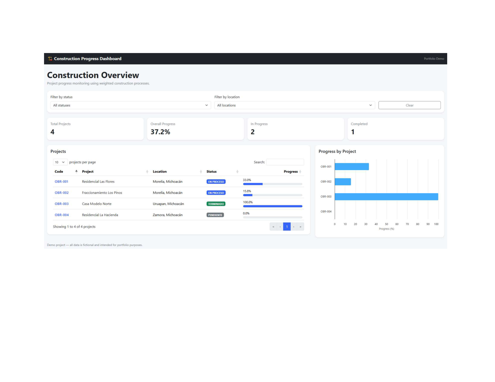
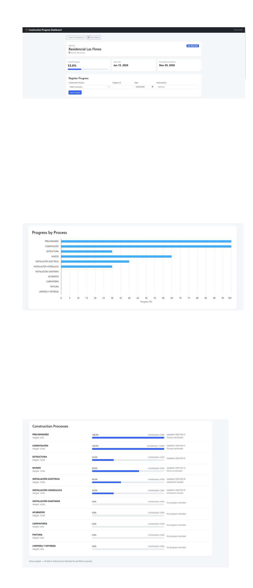
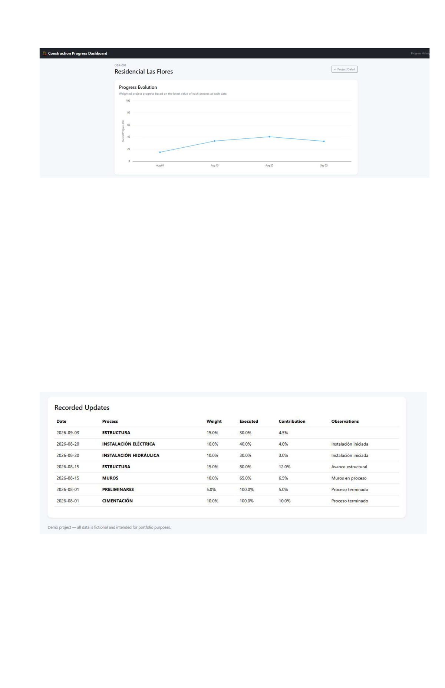

# Construction Progress Dashboard

A web-based dashboard for monitoring construction projects, tracking execution progress, generating indicators, and visualizing project performance.

## 📊 Overview

Construction Progress Dashboard is a portfolio project designed to demonstrate the development of a business-oriented web application for construction project monitoring.

The system allows users to:

- Monitor multiple construction projects
- Track progress by construction process
- Calculate overall project progress using weighted percentages
- Register and update execution progress
- Review historical progress
- Visualize project performance through interactive charts
- Filter projects by status and location
- Review project-level indicators

> **Note:** All project names, locations, progress data, and other information included in this repository are fictional and intended for demonstration purposes only.

---

## 🚀 Features

### Dashboard

- Total projects indicator
- Overall construction progress
- Projects in progress
- Completed projects
- Project status and location filters
- Interactive project table
- Progress visualization by project

### Project Detail

Each project includes:

- Project information
- Start and estimated completion dates
- Overall weighted progress
- Progress by construction process
- Process weighting
- Execution percentage
- Contribution to overall progress
- Observations
- Progress registration

### Progress History

The system maintains a historical record of project progress and provides:

- Progress evolution over time
- Historical progress chart
- Date-based progress records
- Process-level updates
- Weighted progress calculation

---

## 📈 Progress Calculation

Project progress is calculated using the weighting assigned to each construction process.

The contribution of each process is calculated as:

```text
Process Weight × Execution Progress / 100
```

The overall project progress is the sum of the contribution of all processes.

### Example

```text
Foundation

Weight: 10%
Execution Progress: 80%

Contribution:

10 × 80 / 100 = 8%
```

Therefore, the foundation contributes **8 percentage points** to the overall project progress.

---

## 🛠️ Technologies

### Backend

- PHP
- PDO
- MySQL

### Frontend

- HTML5
- CSS3
- JavaScript
- Bootstrap 5
- DataTables
- Highcharts

### Development Tools

- XAMPP
- Apache
- MySQL
- Git
- GitHub

---

## 🗂️ Project Structure

```text
construction-progress-dashboard/
│
├── .gitignore
├── README.md
│
├── config/
│   └── database.example.php
│
├── database/
│   └── database.sql
│
└── public/
    ├── index.php
    ├── detail.php
    ├── history.php
    └── save_progress.php
```

---

## 🗄️ Database Structure

The application uses three main tables.

### `proyectos`

Stores construction project information, including project code, name, location, dates, status, and active status.

### `catalogo_procesos`

Contains the construction process catalog and its weighting.

Example processes include:

- PRELIMINARES
- CIMENTACIÓN
- ESTRUCTURA
- MUROS
- INSTALACIÓN ELÉCTRICA
- INSTALACIÓN HIDRÁULICA
- INSTALACIÓN SANITARIA
- ACABADOS
- CARPINTERÍA
- PINTURA
- LIMPIEZA Y ENTREGA

### `avance_detalle`

Stores progress registered for each project and construction process.

The system supports:

- Partial progress from 0% to 100%
- Date-based progress records
- Observations
- Historical tracking
- Process-level progress
- Weighted contribution calculations

---

## 💻 Local Installation

### 1. Download the repository

Place the project inside your XAMPP `htdocs` directory.

Example:

```text
C:\xampp\htdocs\construction-progress-dashboard
```

### 2. Create the database

Create a MySQL database named:

```text
construction_dashboard
```

### 3. Import the database

Import:

```text
database/database.sql
```

You can use phpMyAdmin or another MySQL administration tool.

### 4. Configure the database connection

Copy:

```text
config/database.example.php
```

and rename the copy to:

```text
config/database.php
```

Then update the database credentials according to your local environment.

Example:

```php
<?php

return [
    'host' => 'localhost',
    'dbname' => 'construction_dashboard',
    'user' => 'root',
    'password' => '',
    'charset' => 'utf8mb4',
];
```

> `config/database.php` is intentionally excluded from version control because it may contain local database credentials.

### 5. Start XAMPP

Start:

```text
Apache
MySQL
```

### 6. Open the application

Navigate to:

```text
http://localhost/construction-progress-dashboard/public/
```

---

## 🔐 Security

The repository does not contain production credentials or confidential information.

The following file is intentionally excluded from GitHub:

```text
config/database.php
```

Only the example configuration is published:

```text
config/database.example.php
```

All demonstration project data is fictional.

---

## 📊 Dashboard Screenshots

Screenshots of the application will be added here.

### Main Dashboard



### Project Detail



### Progress History



---

## 🎯 Portfolio Purpose

This project demonstrates practical experience developing business-oriented web applications and database-driven systems.

The project highlights skills in:

- PHP backend development
- MySQL database design
- PDO database connectivity
- Business logic implementation
- Weighted progress calculations
- Data visualization
- Interactive dashboards
- Historical reporting
- Form validation
- CRUD-style operations
- Responsive web interfaces
- Git version control
- GitHub project management

The main objective is to demonstrate the ability to transform business requirements into a functional software solution.

---

## 💡 Technical Highlights

### Database-driven architecture

The application separates project information, process definitions, and progress records into related database tables.

### Weighted calculations

Construction progress is calculated based on the weighting assigned to each process.

### Historical tracking

Progress records are stored by date, allowing the system to generate historical progress trends.

### Interactive visualization

Highcharts is used to display project progress and progress evolution.

### Data management

DataTables provides searching, sorting, and filtering capabilities for project information.

### Security-conscious configuration

Database credentials are kept outside the public repository using:

```text
config/database.php
```

while only the example configuration is published.

---

## 🔮 Future Improvements

Possible future versions may include:

- User authentication
- Role-based access control
- User management
- REST API
- Advanced reporting
- PDF reports
- Excel export
- Photo evidence for construction progress
- File attachments
- Progress notifications
- Email notifications
- Audit logs
- Advanced project filters
- Production deployment
- Cloud hosting
- Mobile-friendly enhancements

---

## 📌 Project Status

**Completed — Portfolio Version**

The current version includes:

- Project dashboard
- Project detail
- Progress registration
- Weighted progress calculation
- Progress history
- Interactive charts
- Project filters
- MySQL database
- Responsive interface

---

## 👨‍💻 Author

### Paco Ruiz

**Systems Engineer · Full Stack Developer · IT Administrator**

Focused on developing:

- Business applications
- Management systems
- Dashboards
- Reporting solutions
- Database-driven applications
- Process automation

### GitHub

[](https://github.com/soypacool-cloud)

---

## 📄 License

This project is intended for portfolio and demonstration purposes.

The data included in the project is fictional and does not represent real construction projects or confidential business information.
